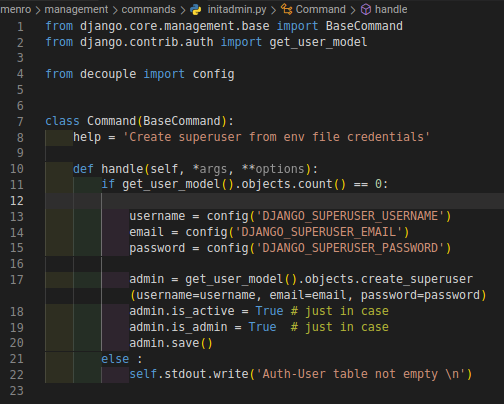
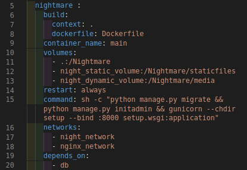

It might have happend to you, sometimes you have instructions that need to be executed every time your application restarts. These instructions can be management commands for special tasks. As your application gets bigger you don't want to execute these commands manually, each time after you bring down your docker containers for updating a slight part of your application.

One quick and simple way of handling such thing is to add these commands to the command list of your docker files, so they get executed right before your application goes online.

<h1>Add this functionality to your project : </h1>

<ol>
<li>First, write your management command</li>

<li>Then, add the command (<code>python manage.py ....</code>) to your python container, in docker-compose commands.</li>
<ul><li>order of these commands matters</li></ul>

</ol>

<h2>Example</h2>

As you can see in this project, in <em><code>menro > management > commands > initadmin</code></em>, a management command is written. Every time that docker containers go up, this command will be executed and checks if no users is created in the database, creates a superuser with provided credentials in <em><code>.env</code></em> file.

</img>

<code>python manage.py initadmin</code> is the command that now goes to docker-compose <em><code>command</code></em> section.

</img>

The order of these commands is important, for instance is this case we can't put <code>python manage.py migrate</code> after our custom management command since it needs the auth-user table to exist in the database.

<h3>Running this project :</h3>

<ol>
<li>clone the repository</li>
<li>open the terminal and cd to directory of the project</li>

<li>run these commands : </li>
<ul>
<li><code>docker volume create night_postgresql</code></li>
<li><code>docker volume create night_static_volume</code></li>
<li><code>docker volume create night_dynamic_volume</code></li>
<li><code>docker network create night_network</code></li>
<li><code>docker network create nginx_network</code></li>
</ul>

<li>run <code>docker-compose up -d</code></li>
<li>run <code>docker ps -a</code> to check the health of your containers</li>
<li>go to your browser, to <em><code>0.0.0.0:80/admin</code></em></li>
<li>Check out the values of <em><code>DJANGO_SUPERUSER_USERNAME</code></em> and <em><code>DJANGO_SUPERUSER_PASSWORD</code></em> in <em><code>.env</code></em> file, and login to admin-panel with them</li>
</ol>

This way you don't have to run <code>python manage.py createsuperuser</code> manually, each time you restart your database.

